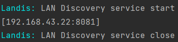

# Landis
a go LAN discovery tool kits package

## contributor
MurInJ

## function
Get the address that are using this service in the same LAN

## install
```shell
go get github.com/MurInJ/Landis
```

## quick start
start follows service at diffirent devices
```go
s := Landis.NewLanDiscovery(8081)
//s.SetDebug(true)
s.Start()
defer s.Close()

time.Sleep(time.Second * 5)
fmt.Println(s.List())
```
and you will see\


### PS
if you can`t run it normally,please check your firewall or you net